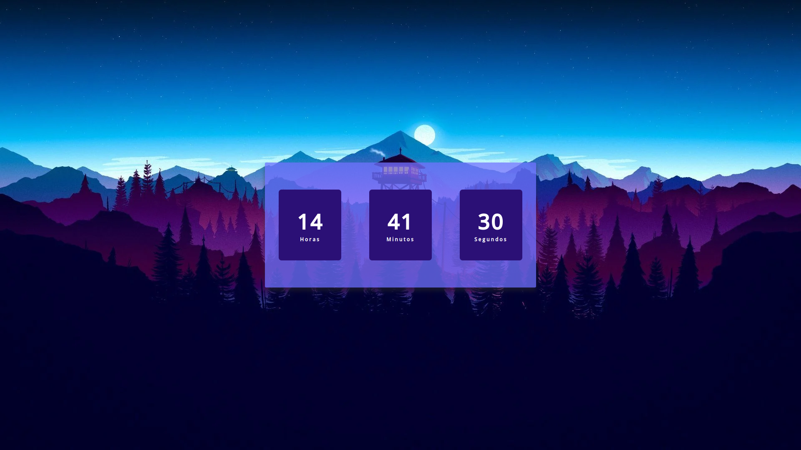

<h1 align="center">Digital Watch</h1>

Real-time digital clock

  <a href="#-layout">Layout</a>&nbsp;&nbsp;&nbsp;|&nbsp;&nbsp;&nbsp;
  <a href="#-technologies">Technologies</a>&nbsp;&nbsp;&nbsp;|&nbsp;&nbsp;&nbsp;
  <a href="#-project">Project</a>

 

## 🔥 Layout

   

## 🌐 Technologies
This project was developed with the following technologies:
- HTML and CSS
- JavaScript

## 💻 Project
Digital clock synchronized with the user's device time.

- [Visit the project online](https://esthefany-dev.github.io/relogioDigital/)
---
👩‍💻 by [Esthefany-Dev](https://github.com/Esthefany-Dev)
